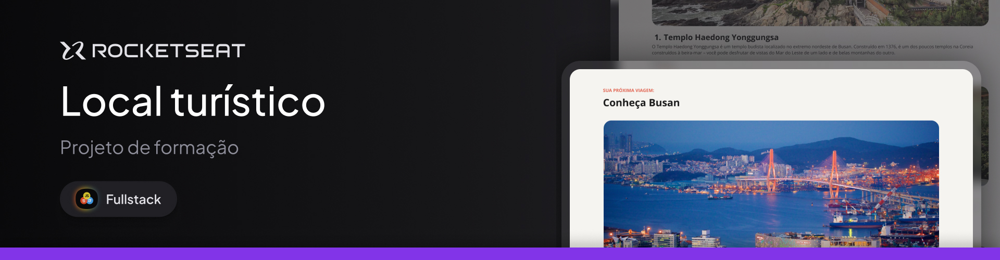

# Desafio prático - Local Turístico

Este projeto é uma página web desktop com informações sobre um local turístico. Esse é um dos desafios práticos da formação Fullstack da @Rocketseat.

## Conceitos aprimorados

- Estrutura HTML;
- Fontes;
- Imagens;
- Alterações das cores dos textos;
- Estilizações com CSS;
- Espaçamentos;
- Listas desordenadas;
- Alterações dos pesos dos textos;
- Responsividade.

> [Live Demo 🚀](https://santos-vinicius.github.io/local-turistico/)
